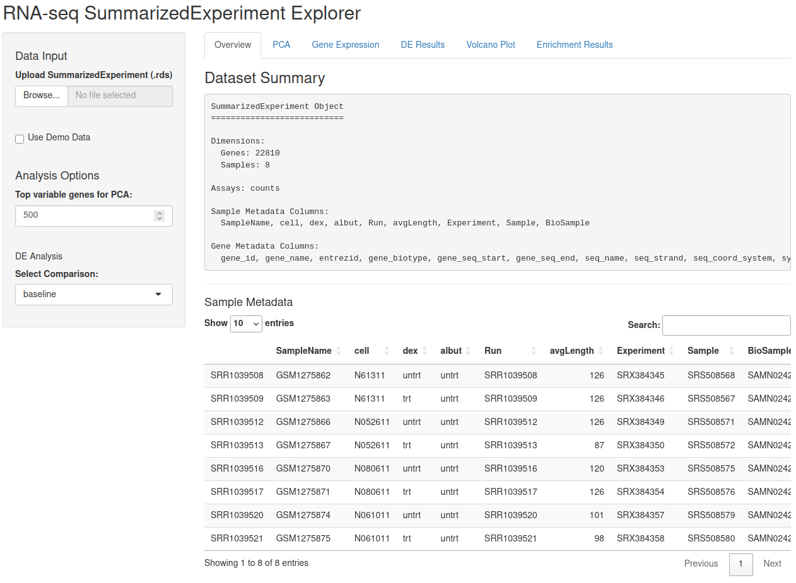
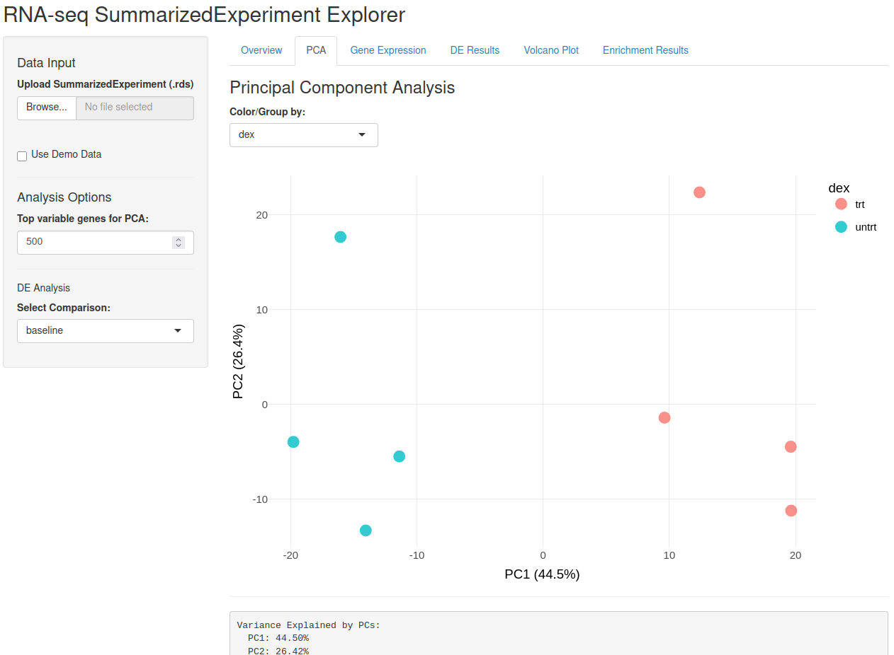
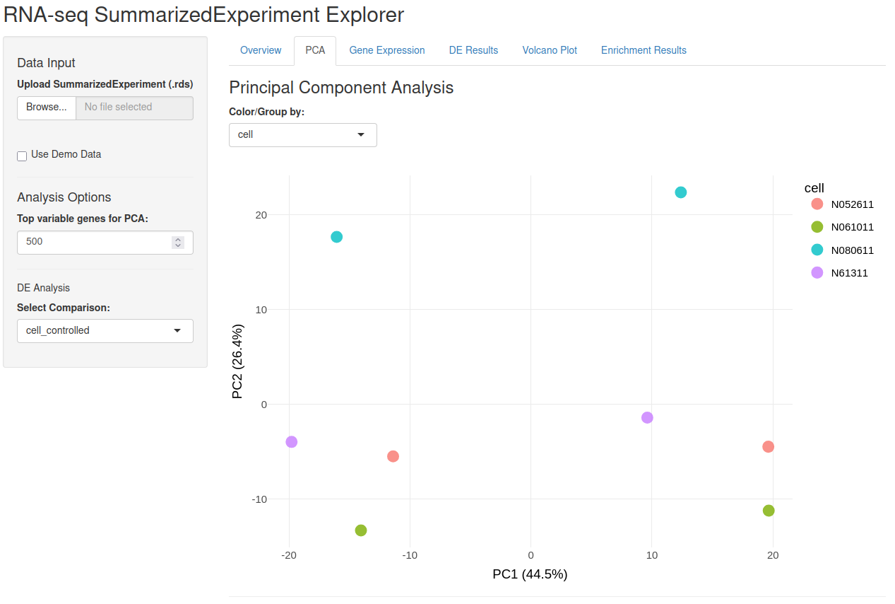
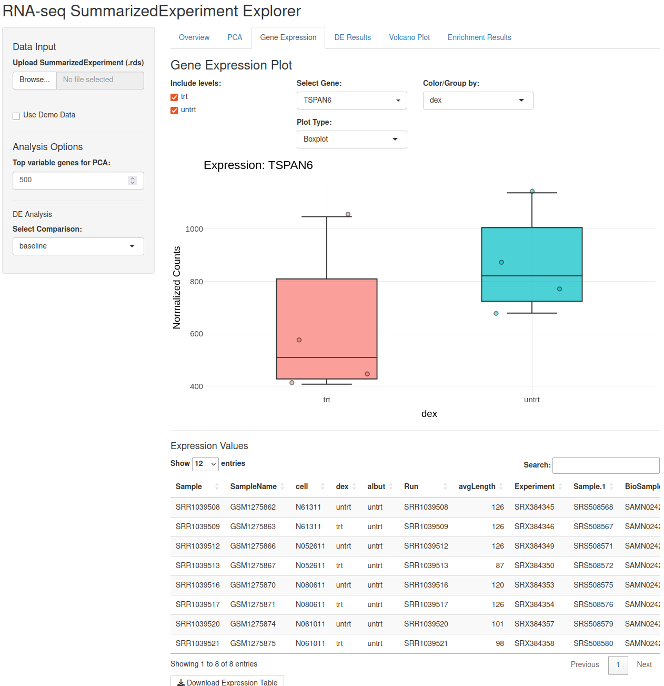
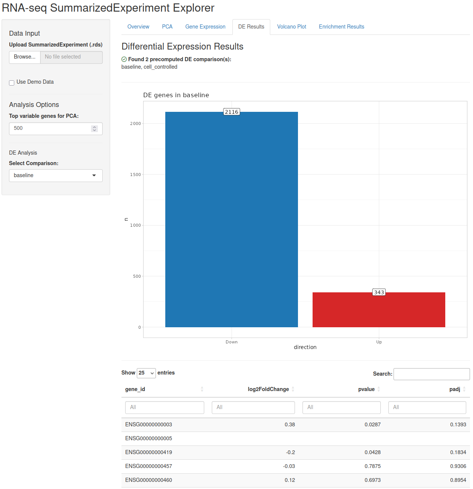
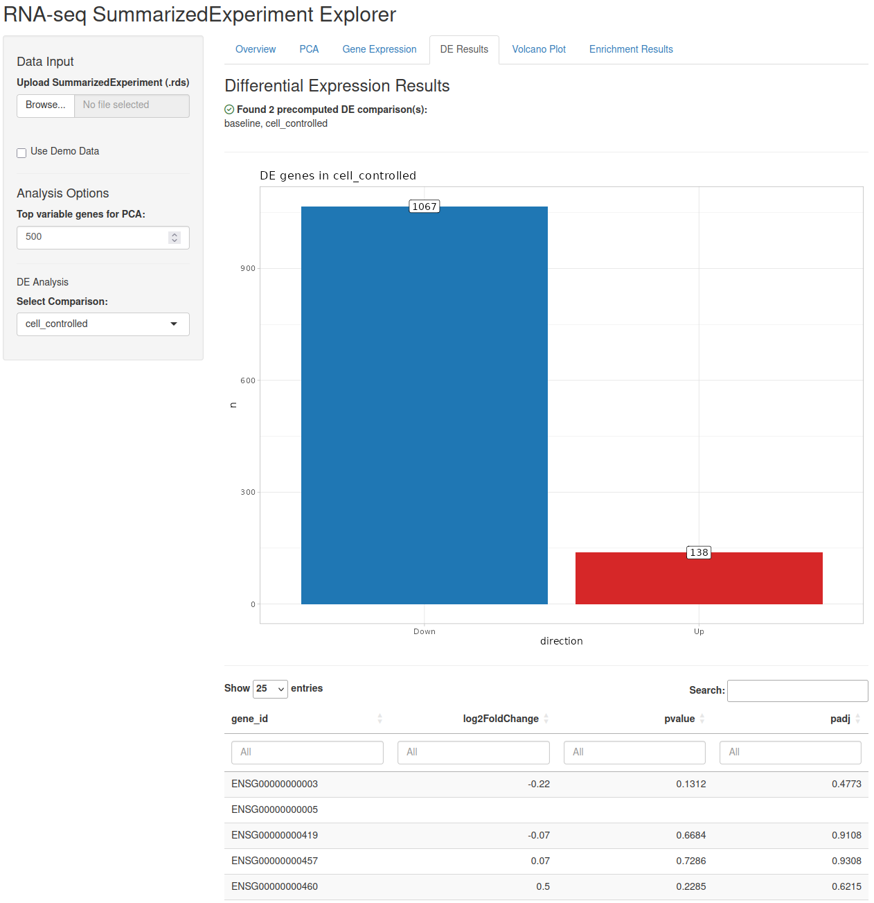
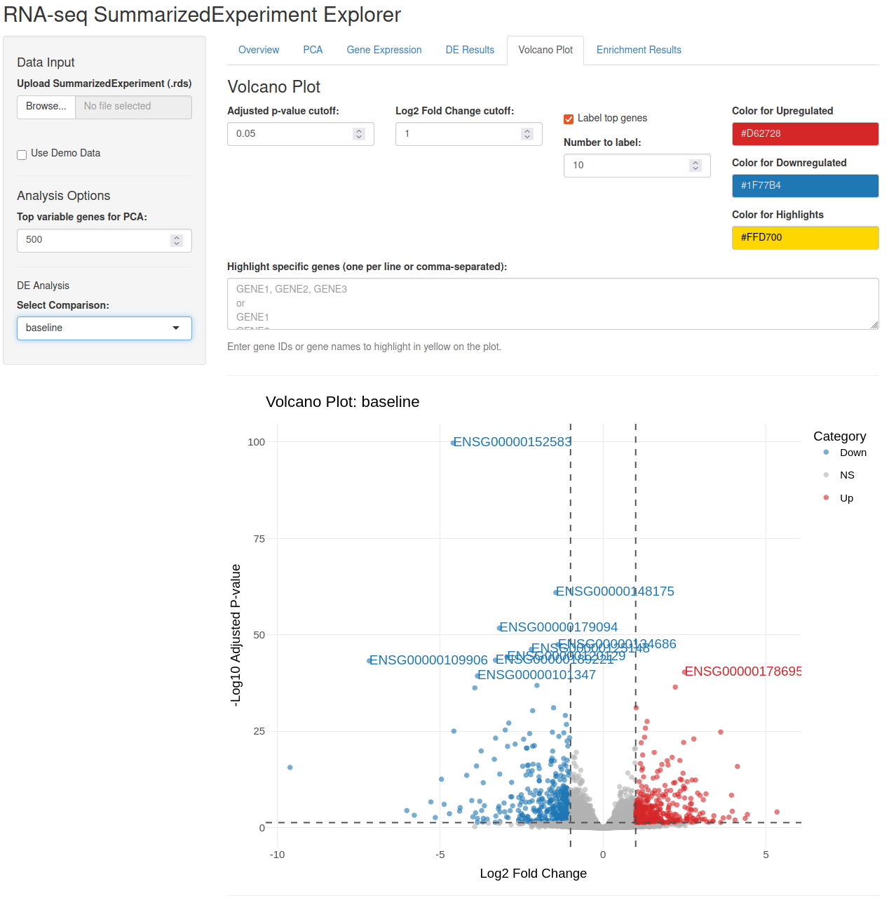
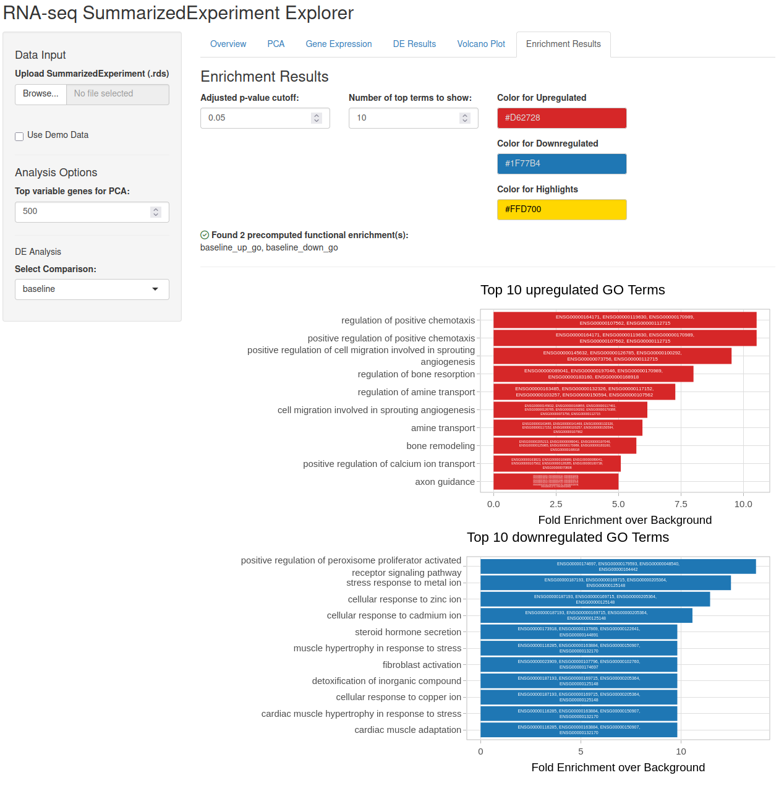
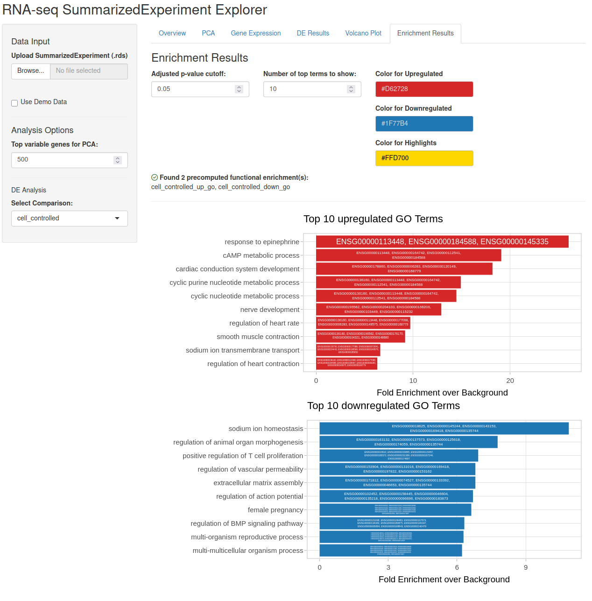

```{r setup, include = FALSE}
knitr::opts_chunk$set(
  collapse = TRUE,
  comment = "#>"
)
```

# Introduction 
exploreSE is package that provides an interactive Shiny-based user interface for exploring transcriptional data and anaylsis results stored in [summarizedExperiment](https://www.bioconductor.org/packages/release/bioc/html/tidySummarizedExperiment.html) or [DeeDeeExperiment](https://bioconductor.org/packages//release/bioc/html/DeeDeeExperiment.html) format. The aim is to facilitate easy comparison between different model apporaches on a single data set. 

Once installed, the packages can be accessed through the following bit of code:

```{r library}
library(exploreSE)
```

To explore the results of differential expression analysis, we need to organise them in the structure and you will learn how to do that in this vignette. If you want to explore on your own, you can  run the following code and start exploring the example data.

```{r quickstart, eval=FALSE}
example(iSEE, ask = FALSE)
```


# Setting up the data
For the purposes of this example, we'll be using the `airway` data [citiation]. It is part of the [airway](https://www.bioconductor.org/packages/release/data/experiment/html/airway.html) package, containing RNA-Seq data from different airway smooth muscle cell lines either untreated or treated with dexamethasone.

```{r airway-dataset}
library(airway)
data(airway)
airway
```

Out of the box, the `airway` object is `summarizedExperiment` object, containing eight samples from four cell lines. This information is available in `coldata(airway)`.

```{r coldata_example}
colData(airway)
```

In this vignette, we will subset `airway` to only contain protein-coding genes. The required information is stored in its `rowData`, accessible through `rowData(airway)`.

```{r rowdata_example}
rowData(airway)
```

```{r example_filtering}
dim(airway)
airway <- airway[rowData(airway)$gene_biotype == "protein_coding", ]
dim(airway)
```

Let's start our anaylsis. Using the [DESeq2](https://bioconductor.org/packages/release/bioc/html/DESeq2.html) package, we will convert airway into an `DESeqDataSet` and build a simple model based the dexamethasone stimulation stored in the `dex` variable. 


```{r example_adding_baseline}
library(DESeq2)
airway <- DESeqDataSet(airway, design = ~dex)
airway <- DESeq(airway)
baseline <- results(airway)
```

In addition, we'll build a second model, where we control for the effect of the cell line: 

```{r example_adding_controlled}
design(airway) <- ~ cell + dex
airway <- DESeq(airway)
cell_controlled <- results(airway)
```

Using the [DeeDeeExperiment](https://bioconductor.org/packages//release/bioc/html/DeeDeeExperiment.html) package, we will store these results in the theuir respective slots. 

```{r example_deedee}
library(DeeDeeExperiment)
airway <- DeeDeeExperiment(airway)
airway <- addDEA(airway, baseline)
airway <- addDEA(airway, cell_controlled)
```

Let's take a look:

```{r example_structure_showcase}
airway
```

In addition to differential expression anaylsis, we can also explore some biological data mining, in this case GO ORA. Here we use the `get.gos()` function from the `exploreSE` package, but it jsut populates the FEA slot of the DeeDeeExperiment. 


```{r example_gos}
airway <- get.gos(obj = airway, NAME = "baseline", gene_type = "ENSEMBL")
airway <- get.gos(obj = airway, NAME = "cell_controlled", gene_type = "ENSEMBL")
```

```{r example_showcase_with_gos}
airway
```

Now that our data is ready, we can explore the data. 

# Launching the App
The simplest way to launch the app is through a call to the `exploreSE()` function. Without any arguments, the app opens and you can load in any .RDS file. Alternatively, you can supply the `file` argument, defining the path to the file, or the `object` argument when you have the object already loaded.

```{r running_the_app, eval=FALSE}
app <- exploreSE(object = airway)
shiny::runApp(app, port = 1234)
```



After starting the app, you are created with an overview of the metadata in the `colData` of the relevant `summarizedExperiment`, as well as a search- and scrollable view of the same table. 
On the left hand side, you can load in a different object from the local environment if desired under the "Data Input header" - should you start up the app without any data, the "Use Demo Data" checkbox will be checked and some demo data will be generated for you. 
Below that, you will find some options for the your data exploration:
You will have your choice of the relevant gene identifier; by default it picks the first column from your `rowData`, but with the drop-down menu that behavior can be changed.
Secondly, you can pick your differential expression analysis; these come from the relevant slots from the underlying `DeeDeeExperiment` or m̀etdata()`. 


## Overview
On the top side, you have 6 riders to choose from: 
1. Overview,  currently selected
2. PCA; an overview of the principle component visualisation 
3. Gene Expression, where the expression of a selected gene is visualised
4. DE Results; the currently selected DE comparison is summarised and visualised
5. Volcano Plot: a volcano plot of the selected DE comparison
6. Enrichment Results: present enrichment results are plotted


## PCA view
Progressing through the app, you can navigate to the PCA rider.


You can select the coloring scheme of the the points in the drop down menu, as well as how many genes are used to calculate the PCA. 
In the `airway` dataset, the dexamethasone treatment, saved in the `dex` variable, is the primary variable of interest, but you can also select other from the dropdown menu. 




## Expression plotting

Navigating to the Gene Expression tab, you can check the expression of selected genes. By selecting a value in the Color/Group by drop-down menu, you can select the value on the x-axis. You can also include/exclude certain levels of that variable through the tick boxes on the left. The gene being plotted is selected by the "Select Gene" dropdown, which is searchable. Any values visible in the plot can be exported from the table below. 




## DE Results

The heart of this application is the comparison of different possible models and within this tab, we are starting that process. 



On the topof the page, a little overview indicates all the comparisons found in the respective slots. 
Below, a barchart indicates the number oif differentially expressed genes. The specifics of the results can looked up in a table below and exported. 

This view alöso exists for each comparison; selecting a different comparison from the drop-down menu on th eleft hand side refreshes the view:



## Volcano plot

A graphical overview over the differential expression can be found in the Volcano Plot tab.



On the top of this tab, a variety of graphical settings can be determined: the cutoffs for the different colors, a number of genes to label and the colorcode are all freely changeable. Again, this view depends on the selected comparison. 

## Enrichment results 

For interpretation of these results, you often rely on the different enrichment methods that to determine which biological themes or pathways are altered in a given comparison. These results are visualised in the Enrichment Results tab.



In this case, we are looking at the GO term enrichments for the baseline model. Like before, some graphical adjustments can be set at the top. Below, we have two bar charts, one for each direction of the comparison. The genes driving the enrichment are written inside the bars. 

Again, switching the comparison refreshes this view. 


# FAQ

**Q: How do I add results into the summarizedExperiment?**
A: The easiest way is to use the `DeeDeeExperiment` extension of the `summarizedExperiment` class. You can use the dedicated DEA and FEA solts. There is a detailed explanation [here](https://bioconductor.org/packages//release/bioc/vignettes/DeeDeeExperiment/inst/doc/DeeDeeExperiment_manual.html). If you do not want that, you can add it to the `summarizedExperiment` metadata, using `de-results`and `fe_results`as names. 
**Q: can I use the explorer to perform analyis?**
A: No, this app is only design to visualise already performed analyses. All decisions on what to test, what enrichmenrs to run should happen before you start the app and make use of the package. 

# Session Info

```{r session_info}
sessionInfo()
```


